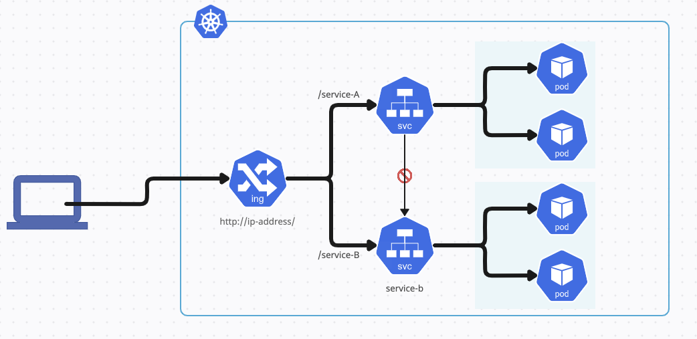

# AKS Cluster Project

## Cluster Details

**Azure Kubernetes Service (AKS)**
- Utilized Azure Kubernetes Service (AKS) for orchestrating containers.

**Kubernetes Cluster Setup**
- Established a Kubernetes (K8S) cluster with Role-Based Access Control (RBAC) enabled and Calico for network policy.

**Services**
- Created two services, A and B, within the Kubernetes cluster. (Dockerized each app)
    - Implemented Service A to fetch and display the current Bitcoin value every minute, providing the 10-minute average every 10 minutes.
    - Configured Service B to print "Hello Microsoft."

**Ingress Controller**
- Deployed an NGINX Ingress controller to manage external access
- Configured the Ingress controller to redirect traffic based on the URL:
  - For Service A: `xxx/service-A`
  - For Service B: `xxx/service-B`

**Service Communication Policy**
- Ensured that Service-A cannot communicate with Service-B by creating the necessary policy with Calico.

## General Guidelines

**Production-Ready Cluster:**
   - Treated the cluster buildout as a production-ready setup.
   - Automated the entire process for setting up the cluster with powerShell script.
   - Ensured repeatability of the process.

**Code Supportability:**
   - Wrote code and scripts with a focus on supportability.
   - Included necessary comments, documentation, and error handling.

## Usage Instructions

    Requirements: Azure account, azure CLI, kubectl, helm, azure/kubelogin

    1. **Azure Account Setup:**
        - Create an Azure account if not already available.
        - Obtained necessary credentials and configured Azure CLI.

    2. **Cluster Deployment:**
        - Run the Deployment script, "./deploy.ps1"
            Mandatory params:
            - $subscriptionId
            - $resourceGroupName
            - $location
            - $clusterName
            - $role             --> relevant RBAC role
            - $assignee         --> Creator username or objectId
            - $yamlsPath        --> path to yamls directory

    example:
        ./deploy.ps1 -subscriptionId "XXX-XXX-XXX-XXX" -resourceGroupName
         "exampleGroup" -location "israelcentral" -clusterName "exampleCluster"
          -role "Azure Kubernetes Service RBAC Cluster Admin" -assignee "xxx-xxx-xxx-xxx" -yamlsPath "yamls"

## Project Milestones
- I gained knowledge in Kubernetes, Docker, AKS, Azure CLI, Helm, manifest handling, deployment scripting, network policies, and Ingress controller configuration. Project development included Dockerizing services, setting up an AKS cluster, and automating deployment with PowerShell. Thorough documentation and usage instructions capped off the project.
## Additional Notes - Future Improvements

For future iterations of this project, consider implementing the following enhancements:

- **Helm Chart Deployment:**
  - Streamline the deployment process by using Helm Charts to manage Kubernetes manifests more efficiently.

- **Infrastructure Scalability:**
  - Enhance scalability by building the cluster with either Terraform or ARM Templates. This will provide a more robust and flexible infrastructure foundation.

## Diagram

